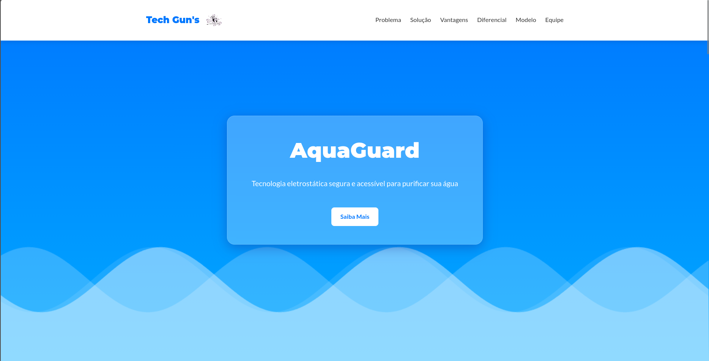

<div align="center">

# 💧 AquaGuard

**Tecnologia eletrostática segura e acessível para purificar sua água.**

> 🔗 **[Acesse o projeto online aqui](COLOQUE-O-LINK-DO-DEPLOY-AQUI)**

</div>

---

## 💻 Preview

<div align="center">
  <!-- Renomeie a imagem image_f5702a.png para preview.png e coloque na raiz do projeto -->
  
</div>

## 🧠 Sobre o Projeto

O **AquaGuard** é uma solução inovadora desenvolvida pela equipe **Tech Gun's**[cite: 9]. O projeto apresenta uma landing page moderna e responsiva que detalha nossa proposta de utilizar tecnologia eletrostática para tornar a purificação de água mais eficiente, segura e acessível para todos[cite: 9]. 

## ✨ Estrutura da Plataforma

A página foi estruturada como uma Single Page Application (SPA) para uma navegação fluida entre os seguintes tópicos[cite: 9]:

* 🚨 **O Problema:** Contextualização da dificuldade de acesso à água potável[cite: 9].
* 💡 **A Solução:** Como o AquaGuard resolve esse problema de forma inteligente[cite: 9].
* ⭐ **Vantagens & Diferencial:** Os benefícios da nossa tecnologia eletrostática em comparação aos métodos tradicionais[cite: 9].
* ⚙️ **Modelo:** Explicação técnica e visual do funcionamento do sistema[cite: 9].
* 👥 **Equipe Tech Gun's:** Apresentação dos desenvolvedores e idealizadores do projeto (Abgail, Adriele, André, Daniel, Marcelo e Ster)[cite: 8, 9].

## 🛠️ Tecnologias Utilizadas

Este projeto foi construído utilizando as melhores práticas de desenvolvimento web moderno:

* **[React](https://reactjs.org/)** (Biblioteca de interfaces)[cite: 8]
* **[Vite](https://vitejs.dev/)** (Ferramenta de build ultrarrápida)[cite: 8]
* **JavaScript (ES6+)** (Lógica e componentização)[cite: 8]
* **CSS3** (Estilização avançada com efeitos visuais fluidos)[cite: 8]

## 🚀 Como rodar o projeto localmente

Siga os passos abaixo para rodar o AquaGuard no seu ambiente de desenvolvimento:

```bash
# Clone este repositório
git clone [https://github.com/DanielSousa07/AquaGuard.git](https://github.com/DanielSousa07/AquaGuard.git)

# Acesse a pasta do projeto
cd AquaGuard

# Instale as dependências
npm install

# Inicie o servidor de desenvolvimento
npm run dev
```

---

<div align="center">
  Desenvolvido com 💻 e 💧 pela equipe <strong>Tech Gun's</strong>. <br>
  (Membro da equipe: <a href="https://github.com/DanielSousa07">Daniel Sousa</a>)
</div>
